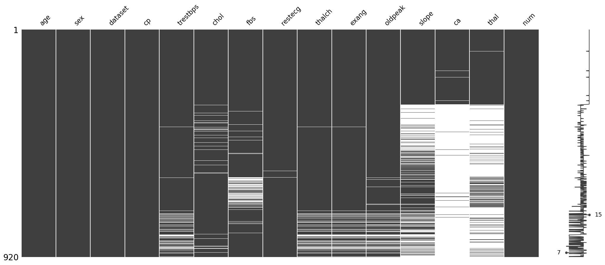

## AC209 Project

* Title: Multivariate Analysis and Prediction of Heart Disease
* Data source: https://www.kaggle.com/datasets/redwankarimsony/heart-disease-data

#### Column Descriptions:
- id (Unique id for each patient)
- age (Age of the patient in years)
- origin (place of study)
- sex (Male/Female)
- cp chest pain type ([typical angina, atypical angina, non-anginal, asymptomatic])
- trestbps resting blood pressure (resting blood pressure (in mm Hg on admission to the hospital))
- chol (serum cholesterol in mg/dl)
- fbs (if fasting blood sugar > 120 mg/dl)
- restecg (resting electrocardiographic results)
    - Values: [normal, stt abnormality, lv hypertrophy]
- thalach: maximum heart rate achieved
- exang: exercise-induced angina (True/ False)
- oldpeak: ST depression induced by exercise relative to rest
- slope: the slope of the peak exercise ST segment
- ca: number of major vessels (0-3) colored by fluoroscopy
- thal: [normal; fixed defect; reversible defect]
- num: the predicted attribute 
    - 0: No heart disease (absence of disease).
    - 1-4: Presence of heart disease, with varying severity.The exact meaning of values 1 through 4 can depend on the specific dataset, but they generally indicate the extent or severity of the disease:
        - 1: Mild heart disease.
        - 2: Moderate heart disease.
        - 3: Severe heart disease.
        - 4: Very severe heart disease.

#### Tentative steps
1. Examine the missingness of data

- Only a small number of observations have features `slope`, `ca`, `thal`. Decide to delete them for now.
- The missing pattern of `thalch`, `exang`, `oldpeak` is similar. Should be 
